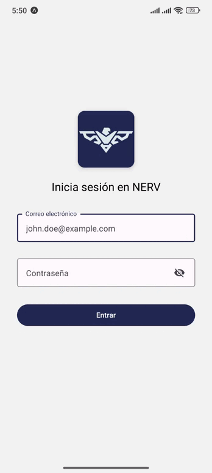

# NERV — Instrucciones de instalación y despliegue

Este repositorio contiene una aplicación React Native desarrollada con Expo. Este README reúne pasos detallados para instalar, ejecutar en desarrollo.

Contenido
- Requisitos
- Instalación (dependencias)
- Desarrollo (ejecución local)
- Builds / Producción (EAS / Expo)

## Requisitos

- Node.js (recomendado: Node 18 LTS o posterior). Comprueba con `node -v`.
- npm (se instala con Node) o yarn (opcional).
- Expo CLI (opcional para desarrollo): `npm install -g expo-cli` o usar `npx expo`.
- Para builds nativos iOS se necesita macOS y Xcode instalados (solo si no usas EAS managed builds).
- Para builds y envíos a stores se recomienda usar EAS (Expo Application Services).

## Preparar el entorno (instalación de dependencias)

1. Clona el repositorio y sitúate en la carpeta del proyecto:

```zsh
cd /ruta/a/tu/proyecto
# si tu repo local está en nerv-2:
cd nerv
```

2. Instala las dependencias declaradas en `package.json`:

```zsh
npm install
# o con yarn
yarn install
```

Nota: `package.json` incluye dependencias de `react-navigation` y otras librerías. Si ves errores de módulos no encontrados, ejecuta `npm install` de nuevo o instala explícitamente las dependencias faltantes (ej.: `@react-navigation/native`).

## Ejecutar en desarrollo

1. Levantar el servidor de desarrollo (Expo):

```zsh
npm run start
# o con expo directly
# npx expo start
```

2. Abrir en dispositivo/emulador:

- Desde la interfaz de Expo (navegador) puedes abrir en Expo Go en un dispositivo móvil escaneando el QR.
- Para iOS Simulator o Android Emulator puedes usar las opciones que muestra `expo start` o ejecutar:

```zsh
npm run ios   # abre el simulador iOS (si está configurado)
npm run android # abre el emulador Android
```

## Notas del proyecto

- Navegación: se usa React Navigation (Stack Navigator). Hay un `AuthProvider` que actúa como guard para rutas protegidas.
- TypeScript: el proyecto está tipado; ejecuta `npx tsc --noEmit` antes de commits si cambias tipos.

## Pruebas realizadas en un android:

Modelo: POCO X7 Pro.

Xiaomi HyperOS Android 15

## Comandos para desarrollo

```zsh
# Instalar dependencias
$ yarn install

# Levantar el proyecto
$ yarn start
```

## Comandos para generar el apk en expo

```zsh
# Instalar el CLI
$ npm install -g eas-cli

# Iniciar sesion en expo
$ eas login

# Comando para generar la apk
$ yarn build:apk
```

## Comandos útiles

```zsh
# instalar dependencias
npm install

# comprobar tipos
npx tsc --noEmit

# iniciar desarrollo
npm run start

# abrir en iOS
npm run ios

# abrir en Android
npm run android

# web
npm run web

# EAS build
eas build -p android --profile production
eas build -p ios --profile production
```
